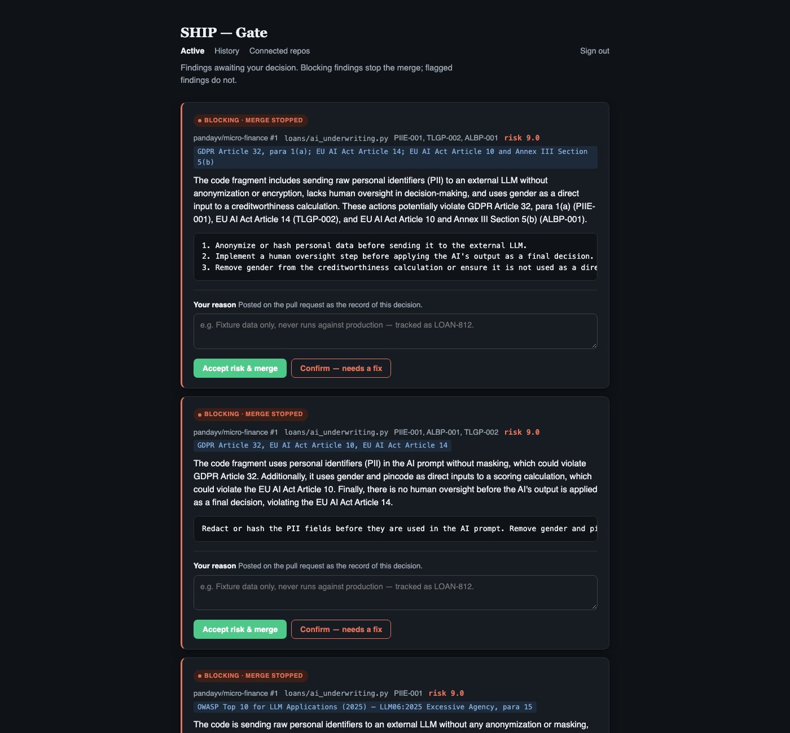

# SHIP

**Every AI feature your team ships is also a legal or operational
decision nobody signed off on.** SHIP is an AI reviewer that reads
every pull request the moment it opens, catches the ones that quietly
cross a legal line, and only interrupts you when it's found something.
Ask it anytime. It answers in one sentence, and shows the details on
your nearest screen.

Built for [Build, Ship, Shape: the Amazon Developer Hackathon](https://amazonappdev2026.devpost.com/)
(Alexa+ track, AWS Builder mini-challenge).



---

## How to see it in action

Three ways to try this.

1. **Experience it live.** Judges: instructions for adding a test PR
   and trying it live are included in the submission materials.
2. **Watch the demo video.** *(Video link goes here before final
   submission.)*
3. **Set it up yourself.** Full steps in [SETUP.md](SETUP.md).

## The problem

Fast-moving teams shipping Gen AI features routinely introduce
compliance hazards without meaning to: unmasked personal data (an SSN,
a zip code) sitting in a prompt, race or gender quietly swaying a
credit decision, an AI decision loop running with no one watching it.

These hazards hurt the people affected, and risk penalties under GDPR
and the EU AI Act. A small team can't afford a dedicated compliance
hire, and reviewing every PR by hand would grind feature velocity to a
crawl.

SHIP closes that gap: it catches AI compliance risk before it ships,
without slowing the team down.

## Guiding principles

**1. Last line of defense.**
Assume nothing was checked before this. It doesn't matter who wrote the
code, a person or an AI. It doesn't matter if the feature uses AI or not.

**2. Grounded, not guessed.**
Rely on facts, not memory or guesswork. Keep improving to make that
grounding sharper.

**3. Meet you where you are.**
The answer finds you, on whatever device is nearest, not the other way
around. Ask by voice from anywhere. See the detail on whatever screen is
closest, a laptop, a TV, even a fridge.

**4. Scalability and resilience.**
Survive retries, failures, and heavy load without breaking.

**5. Cost efficiency.**
Free deterministic checks first, LLM only when needed. Only the right
model for the job, measured.

## What it does

1. **Filters fast, for free.** Screener runs a regex/AST scan on every
   commit. Nothing matches, the PR passes in milliseconds, no model
   call spent.
2. **Judges what's actually wrong.** Detector reviews only what
   Screener flagged, one fragment at a time, grounded against sourced
   regulation text, not memory. It returns a verdict, a risk score, a
   plain-English explanation, a citation, and a draft fix, and learns
   from Gate's own past decisions over time.
3. **Blocks the merge, not just a dashboard.** Triage routes the
   verdict by risk. At or above threshold, the PR's own commit status
   turns red, blocking the merge button itself.
4. **Puts a human in the loop.** Gate is the review console: file,
   risk, explanation, citation, suggested fix, one click to approve or
   reject. The decision posts back to the PR and clears the block.
5. **Reaches you by voice.** Relay carries the same findings to Alexa+
   and your nearest screen, so resolving a finding doesn't require
   opening a dashboard.

SHIP watches for four kinds of risk, backed by six detectors tied to
real law: exposing sensitive personal data, decisions made with no
human review, bias from a protected trait, and AI handed more
authority than it should have. Full detector-by-detector detail,
including the taxonomy IDs used internally, is in
[architecture.html](https://pandayv.github.io/ship-engine/architecture.html).

SHIP is scoped to what a single PR diff can prove. See the architecture
doc for that boundary and what's next.

## The Alexa+ experience

It speaks up only when something needs your attention. Ask it
naturally, from your phone, an Echo, or anywhere else Alexa+ works.
Findings aren't read aloud. Instead, anything that needs your review
shows up on your nearest screen: a phone, a tablet, a laptop, a TV, even
a smart fridge.

> *"Alexa, what's up?"*
> **"2 blockers found. Ready for your decision. Want it on a screen?"**
> *"Show me on the TV."*

The actual findings then appear, live, on whatever screen just answered
to that name.

**Voice can confirm a decision. It can never make one blind.** Ask to
approve a finding you've never looked at, and SHIP refuses. That's the
exact pattern its own TLGP-002 detector flags in *other* people's code,
an AI-mediated decision applied with no human checkpoint. Try it:

> *"Approve it."*
> **"Could you take a look on a screen first, then tell me why?"**

Look at it first, then give a reason, and it goes through for real:

> *"Approve it. Hashed identifiers, this is a false positive."*
> **"Done. Accepted, on the record: hashed identifiers, this is a false
> positive."**

That gate is enforced server-side, because `request_risk_acceptance`
only acts once the finding has been shown on a screen in the
last ten minutes, and a reason is required either way, not by a prompt
asking the model to behave. Skip the review, and there is nothing voice
can say to talk its way past that check.

Alexa+'s own MCP toolkit requires a live account relationship with an
Amazon Solutions Architect before its CLI/device path will connect at
all. That requirement isn't documented anywhere until you're already
mid-setup (see [`FRICTION_LOG.md`](FRICTION_LOG.md) for exactly where and
how it surfaced). The hackathon's own rules anticipate exactly this gap
and name a first-class alternative: a simulated Alexa+ experience in a
web app, source included.
**[Try it live](https://pandayv.github.io/ship-engine/alexa-simulator.html)**.
Every response above comes from the deployed Relay endpoint, over
Streamable HTTP.

## Architecture

Full diagram and component-by-component detail: [pandayv.github.io/ship-engine](https://pandayv.github.io/ship-engine/architecture.html) ([source](docs/architecture.html)).

The one piece worth calling out here: **each flagged issue in a PR is
reviewed as its own independent, retryable job**, queued and picked up by
an independently-scaling reviewer function, rather than one sequential
pass through the whole PR. A fragment that fails outright retries
automatically and lands in a dead-letter queue after repeated failure
instead of vanishing. A fragment that's just slow, or that hits AWS's own
request-rate limit, backs off and retries on its own without blocking
anything else. A PR with several flagged issues takes about as long as
its slowest single issue, not the sum of all of them, and nothing is
silently dropped.

## Tech stack

- **Agent framework:** [Strands Agents SDK](https://github.com/strands-agents/sdk-python)
- **Models:** Amazon Nova Lite as the primary Bedrock backend, chosen on
  measured evidence rather than preference. Benchmarked against Claude
  Haiku 4.5, Nova Pro, Qwen3-235B, GLM-5, and DeepSeek-V3.2 on the real
  adversarial fixtures below: all six caught every genuine violation and
  dismissed every look-alike, but per-model request-per-minute quota is
  what actually bounds review throughput on this account (10/min for
  Claude models vs. 200/min for Nova Lite). See the benchmark table in
  [`src/agents/detector.py`](src/agents/detector.py). Google Gemini serves
  as a credit-exhaustion fallback and a local Ollama model as a fully
  offline reliability fallback. Both are switchable via one env var.
- **Agent runtime:** Amazon Bedrock AgentCore Runtime, the same Detector
  logic deployed to a real managed runtime ([`shipagentcore/`](shipagentcore/)),
  callable in-process for local development or remotely for the deployed
  path, toggled the same way
- **Retrieval:** Amazon Bedrock Titan Embeddings, a small local
  numpy cosine-similarity store (the sourced regulation corpus is a
  few dozen chunks, so a hosted vector database would be pure overhead
  at this scale)
- **Compute:** two AWS Lambda functions, the webhook (fast-ack: verify,
  screen, dispatch) and an independently-scaling fragment processor
  (the actual model call, one fragment per invocation)
- **Queueing:** Amazon SQS, with a dead-letter queue for fragments that
  fail repeatedly and a concurrency cap on the processor so parallel
  reviews stay within the account's real request-rate limit
- **State:** Amazon DynamoDB, six tables. `ship-alerts` (every write
  idempotent, so a webhook redelivery or a retried job can't create a
  duplicate and can't silently re-open a decision a human already made),
  `ship-repos` (which repositories SHIP watches, plus when each last sent
  an event and when one last finished review. The gap between the two,
  surfaced on Gate's connected-repos view, is what a silently broken
  pipeline looks like before anyone needs to notice by accident, see
  `src/storage/repo_store.py`), `ship-status` (a precomputed release
  summary, so Relay's voice path is one `GetItem` regardless of how many
  findings exist, since Alexa+ allows Relay half a second to answer and
  aggregating on read would have blown that budget as findings
  accumulate), `ship-device-connections` (which device is reachable under
  which name, for the push path below), `ship-recent-reviews` (which
  alert was shown on a screen and when, the ten-minute window
  `request_risk_acceptance` checks before acting on a spoken
  confirmation), and `ship-learned-patterns` (the generalized patterns
  above)
- **Web:** FastAPI (the webhook route and the Gate console, one
  deployable app, wrapped for Lambda via Mangum)
- **Voice/MCP:** [MCP Python SDK](https://github.com/modelcontextprotocol/python-sdk)
  (Streamable HTTP, spec `2025-11-25`) powers Relay
  ([`src/relay/`](src/relay/)), deployed as its own Lambda with
  [SnapStart](https://docs.aws.amazon.com/lambda/latest/dg/snapstart.html)
  enabled. A fresh ASGI app is built per invocation, a genuine SDK/Lambda
  incompatibility rather than a style choice. The docstring at the
  top of [`src/relay/server.py`](src/relay/server.py) has the details.
- **Push:** an Amazon API Gateway WebSocket API plus a small dedicated
  Lambda ([`device_gateway_handler.py`](device_gateway_handler.py))
  handling connect/disconnect/register, deliberately separate from Relay
  so Relay's own IAM role stays scoped to exactly what answering a
  question requires. A display sits idle with no polling until Relay
  pushes a finding to it; a real compliance event happens on the order
  of weeks, not seconds, so a poll-every-few-seconds design would spend
  nearly all its traffic finding nothing changed

## Setup

Deploying this yourself needs a real AWS account (Bedrock, Lambda,
DynamoDB, SQS, API Gateway) and about 30–45 minutes, less with
[`deploy.sh`](deploy.sh), which scripts most of it. Full step-by-step
walkthrough, including troubleshooting for a brand-new AWS account:
[SETUP.md](SETUP.md).

## Project structure

```
src/
  agents/
    screener.py        # Fast regex/AST pre-filter + per-fragment isolation
    detector.py         # Strands Agent — RAG-grounded semantic judgment
    triage.py           # Risk-based routing, per-category thresholds
  api/
    main.py             # Webhook route, fast-ack + fragment dispatch
    dashboard.py         # Gate — the human review console
    github_client.py    # Real PR-diff fetching via the GitHub API
    github_writeback.py # Posts findings/decisions back to the PR (comment + commit status)
  aws/
    bedrock_session.py  # Shared Bedrock session + adaptive-retry config
  rag/
    chunker.py           # Regulation text -> citable paragraph chunks
    vector_store.py      # Local embedding store + retrieval
  storage/
    alert_store.py       # DynamoDB — idempotent alert persistence
    repo_store.py         # DynamoDB — which repos SHIP watches
    status_store.py       # DynamoDB — precomputed release summary Relay's voice path reads
    device_store.py        # DynamoDB — which display device is reachable under which name
  taxonomy.py            # Single source of truth: detector <-> corpus <-> Screener trigger mapping
  relay/
    server.py             # Relay — the MCP server; the voice/screen modality split lives here
    modality.py            # Enforces the spoken-response character cap and forbids line breaks
    readmodel.py           # Voice path (reads the precomputed summary) vs. screen path (reads alerts)
    push.py                 # Delivers a payload to one named device over its open connection
rag_corpus/               # Sourced regulation/standard text, verbatim
shipagentcore/             # AgentCore Runtime deployment of Detector
docs/
  alexa-simulator.html     # The web-simulated Alexa+ experience — calls real, deployed Relay
  ship-display.html         # Any-device receiving surface — names itself, waits for a push
  ship-render.js            # Finding-rendering logic shared by both pages above
  architecture.html          # Full pipeline diagram
scripts/
  healing_loop.py          # Periodic corpus-grounding check, decoupled from the hot path
  benchmark_models.py      # The adversarial benchmark behind the Nova Lite model choice
  precompute_embeddings.py # Regenerates rag_corpus/'s cached embeddings
lambda_handler.py          # Webhook Lambda entrypoint
fragment_lambda_handler.py # Fragment-processor Lambda entrypoint
relay_lambda_handler.py    # Relay's Lambda entrypoint — builds a fresh app per invocation, see server.py
device_gateway_handler.py  # WebSocket connect/disconnect/register Lambda entrypoint
tests/                     # 200 tests, no AWS credentials required to run
```

## Status & what's next

The full review pipeline, Screener through Gate, is live and deployed.
The PR's own merge button is gated by a commit status, not a dashboard
entry someone has to remember to check. Freezing an alert sets
`ship/compliance` to failing (promotable to a required check in branch
protection); resolving one recomputes it, closing the loop from detection
to a human decision to the merge button itself.

Relay (the MCP server), the Alexa+ simulated experience, and cross-device
push are also live. See
[The Alexa+ experience](#the-alexa-experience)
above for the full walkthrough.

Things known and deliberately not built yet, not overlooked:
- **Approving an alert doesn't yet push the suggested patch back to the PR
  automatically.** A human still applies it themselves once they've
  reviewed it in Gate. A real GitHub-API integration away, not an
  architecture change.
- **Healing Loop** ([`scripts/healing_loop.py`](scripts/healing_loop.py))
  runs periodically, separately from Detector's own fast path, and
  re-fetches each sourced regulation page to check it still matches word
  for word. A citation never quietly rests on text a regulator has since
  amended. It isn't yet wired to a schedule or an alert channel; running
  it is still a manual step.
- **The Alexa+ CLI/device path itself isn't connected.** It requires an
  AWS account already registered by an Amazon Solutions Architect, a live
  account relationship rather than a self-service step (see
  [`FRICTION_LOG.md`](FRICTION_LOG.md)). The simulated web experience
  calls the identical Relay endpoint a live connection would, exercising
  the same review logic. Only the transport Alexa+'s own infrastructure
  would use to reach it is missing.
- New detectors, beyond what's listed above, for risk patterns that need
  more than a single PR diff to prove: infrastructure/deployment context,
  or behavior observed across multiple files or over time. See the
  architecture doc for where that boundary sits and why.

## License

MIT. See [`LICENSE`](LICENSE).
